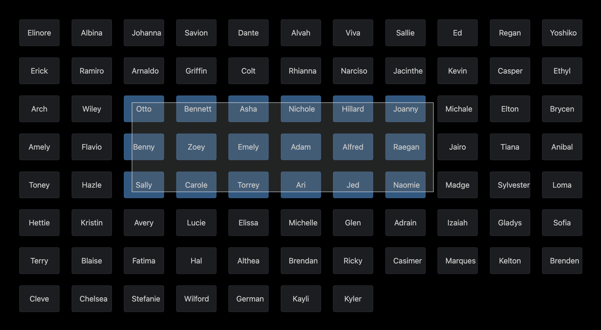

# react-dn-select

Drag and select anything.

<em>Note: this is work in progress...</em>



## Usage

```javascript
  const [items, setItems] = useState<string[]>(['Foo', 'Bar', 'Baz', '...']);

  //...

  <DnSelect
    items={items}
    itemId={(item) => item.toLowerCase()}
    renderItem={({ item }) => <p>{item}</p>}
    onDragStart={(prev) => console.log(`Previous selection: ${prev}`)}
    onDragMove={(current) => console.log(`Current selection: ${current}`)}
    onDragEnd={(final) => console.log(`Final selection: ${final}`)}
    initSelected={['Bar', 'Baz']}
    multi={false}
    escapeKey={true}
    throttleDelay={150}
  />
```
